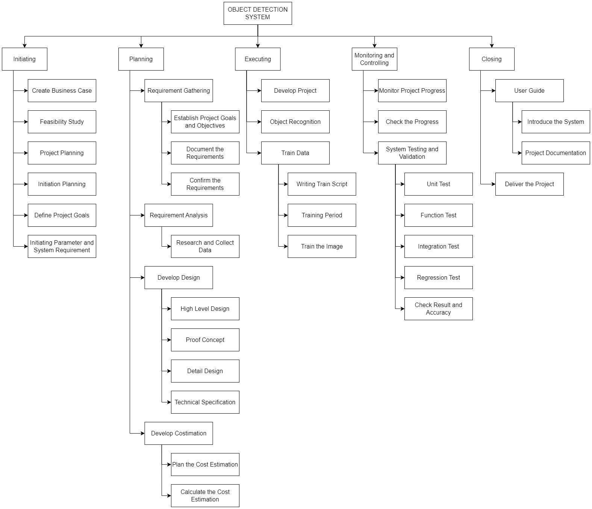
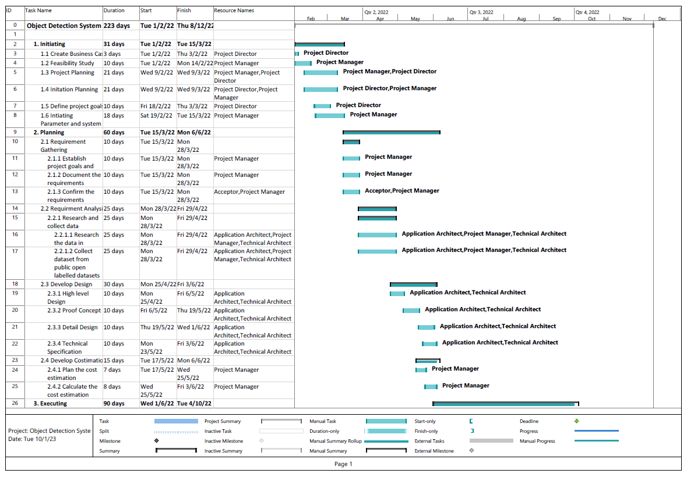
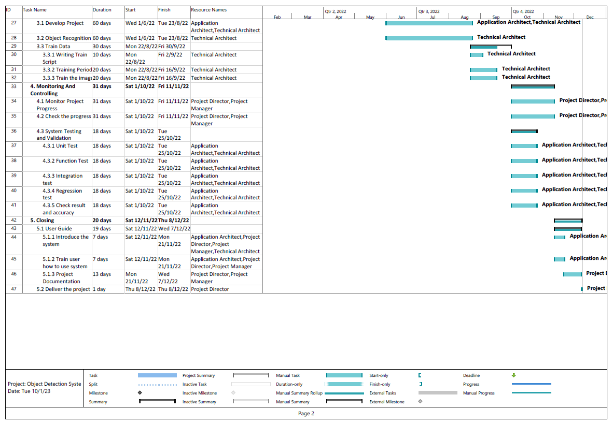

# PROJECT OVERVIEW

## B. PLANNING THE PROJECT

### Project Management Life Cycle
#### WBS

#### Gantt Chart

### Scope

### Risk Identification Chart

| Control Element | What is likely to go wrong? | How and when will I know? | What will I do about it? |
|-----|----|-------|-----|
|Quality   (Poor attitude toward quality; substandard design, materials, and workmanship; inadequate quality assurance program)|1. Inadequate Quality Assurance Program: The system cannot recognize the item correctly because of the noise containing in the Image or the sensor that are blurry. It caused the system confused to detect the object.    2. Inadequate Quality Assurance Program: The quality of the AI model cannot recognize the new object.|How: The Image cannot be detect Based on the pattern or features of the item     When: It Happen during training model|Improve camera sensor or remove noise containing in the image.|
|Cost   (Estimating errors; inadequate productivity, cost, change, or contingency)|1. Contigency: The costing of the maintance will be spiked if there is a failure or the system cannot function properly.    2. Inadequate productivity: Team members face problems in completing their tasks that have been set for them and  it can lead to extra cost need to be allocated |How: when to doing the maintenance the system, the unexpected extra charged will be happen.  When: The problem most probably will be encountered during the project execution and project implementation.|Notify the owner through email whenever budget exceed threshold in the service of the system.
|Time   (Errors in estimating time or resource availability; errors in determining the critical path; poor allocation and management of float; early release of competitive products) | 1. The project was unable to meet the milestones specified in the Gantt Chart.    2. Erros in estimating resource availability: There are insufficient servers to run the object recognition model training. |How: It happens when one of the group members has a problem in developing a project or does not follow the set milestone.    When: During the project execution and monitoring phase, the issue will arise.| The project manager need to monitor the progress of each group member and identify if there are group members who are facing problems in developing the project.|

### Responsibility Assignment Matrices (RAM)

   
##### Next: [Project Implementation ](Project_Documentation/C-Project_Implementation.md) 
