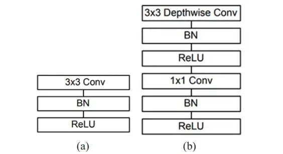

# PROJECT OVERVIEW

## C. IMPLEMENTING THE PROJECT

### Deliverables

Hardware Requirement: Hardware Requirement: For the hardware, our group use our own laptop to develop the system with different specification.

#### Software Requirement:

For the software, our group used python programming language to implement the code for intelligent module in recognizing object, MobileNets a computer vision models for TensorFlow and PHP programming language to design the interface in the website and database connection.

#### Intelligent System Architecture:

In this project, we're going to use the Mobilenet-SSD model to quickly and effectively recognise objects in real time. We will use OpenCV and a deep neural network to construct an object detection Python script.

The MobileNet-SSD design provides good object detection accuracy while being speedier than other architectures, we chose the DNN model based on it. This is true in particular when trying to detect an object in real time on low-powered computer systems like our system. 

Based on streamlined MobileNet Architecture, which uses depth-wise separable convolutions to build lightweight deep neural networks, input will be provided through Realtime video from a camera or webcam. Frames from the input video are sent to the MobileNet layers. The amount of pixel intensity beneath the bright zone and the amount under the dark area are the two factors used to calculate each feature value. These elements are computed using all of the image's potential sizes and areas. An image may include few important qualities that can be utilised to identify the object and many irrelevant features.

a) Standard convolutional layer; b) Depth-wise seperable convolutional

The job of the MobileNet layers is to change over the pixels from the input image into highlights that describe the contents of the image. Then it passes to MobileNet-SSD model to determine the bounding boxes and corresponding class (label) of objects. After that the only last step is to show or display the Output.

OpenCV is a library of programming functions basically focused on real time computer vision. For computer vision applications like CCTV film analysis, video analysis, and picture analysis, OpenCV is a helpful open-source library. It is a fantastic tool for carrying out computer vision tasks and picture processing.

#### Outcomes of the system

Below is the expected outcome for the object detection system .

### Tasks and Estimated Costs

|          Task               | Estimated Costs |         Notes                        |
| :---                        |  :---           |         :---                         |
| Server Maintenance          | $28000          | Monthly Cloud Server                 |
| Construction supervision    | $50000          | Supervision on the project           |
| Cultural resources          | $72000          | Investigate and evaluate undertaking |
| Equipment and equipment use | $1000           | Equipment preparation and setup      |
| Project signs               | $500            | Installation of project signs        |
| TOTAL                       | $151 500        | Estimated                            |

### Milestone Chart

##### Microsoft Project:

   
##### Next: [Project Execution ](D-Project_Execution.md)
 
