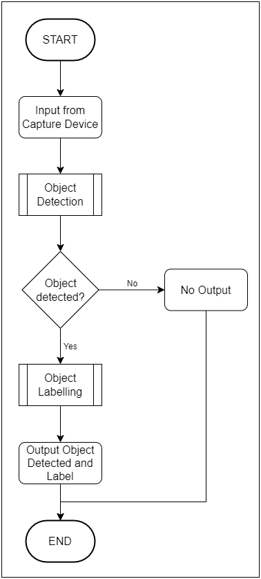
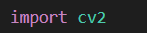
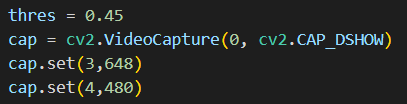
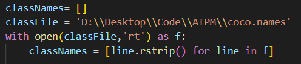
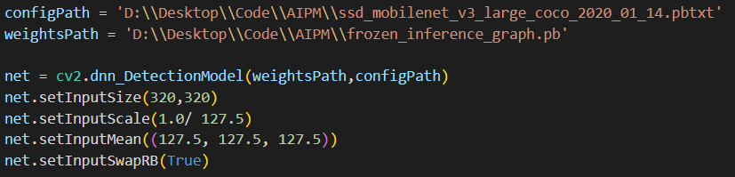
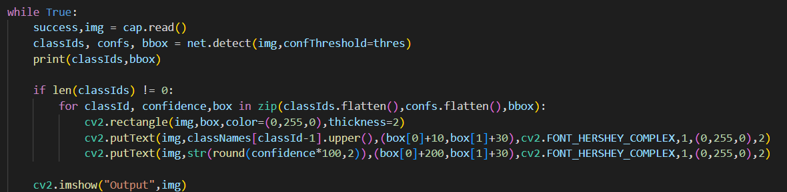
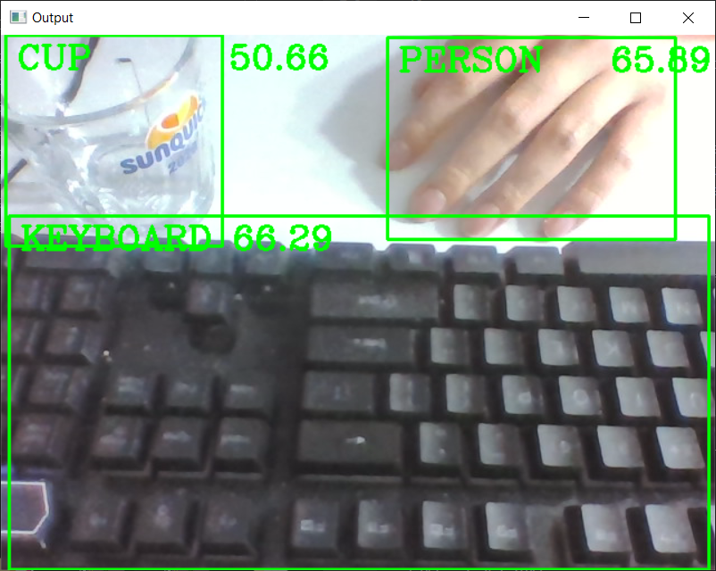

PROJECT OVERVIEW
=====
D. EXECUTING THE PROJECT
-----
### Project Design

#### Flowchart

### Project Coding
#### Import Library

First and foremost, we imported the required python library. The library required for this system is OpenCV. [installation of OpenCV](https://github.com/lawlipyang/AIPM_S2G1_GrpF/tree/main/src#requirements)

#### Setting up capture device

Next, we setting up the capture device we are going to use. We also manage the device to capture in the size that we decided. 

#### Read the list of labels

To allow the system label the object detected, we have a list of labels which is [coco.names](../src). The system will read the file and convert it into a class with ids and labels.

#### Setting up the DNN model

Furthermore, we use the API build in the OpenCV, whichc is used for object detection, as the model of this system. We has set up the Deep Neural Network model using the [weights](../src) and [configurations](../src). There is also some parameters that is set to the model.

#### Detect the object

Finally, the system will show the output of detection. The object that is successfully detected will be surrrounded by a green rectangle and the label will show on the top-left of the rectangle. 

### Project Result
#### Sample Result

