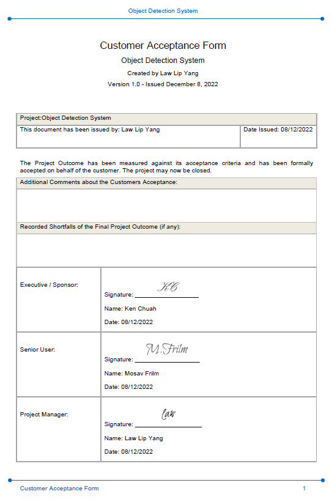
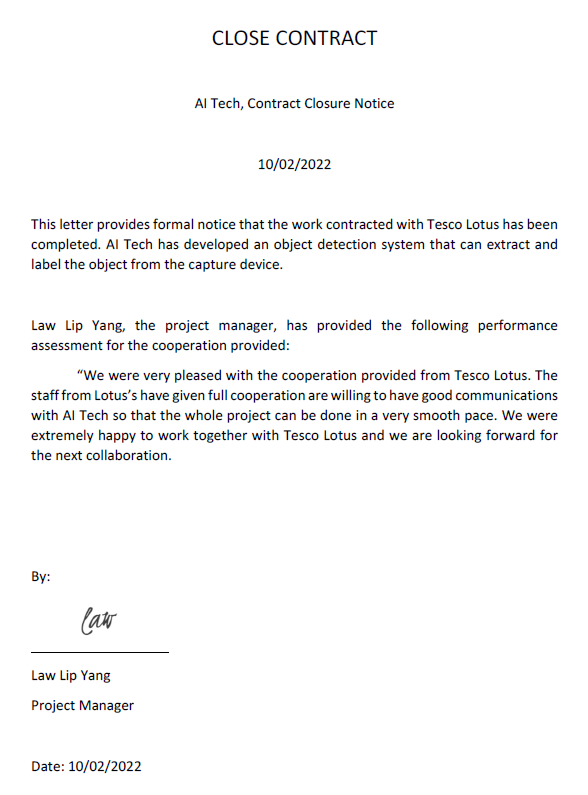

# PROJECT OVERVIEW

## E. PROJECT CLOSING

### Closing Checklist

#### 1. Customer Acceptance Form

#### 2. Lessons-Learned Report

#### 3. Final Report

##### OBJECT DETECTION SYSTEM

##### 1.0 PROJECT OBJECTIVES

##### 2.0 SUMMARY OF PROJECT RESULTS

After the system has been completed, we tested the accuracy of the system. The system is 50%

##### 3.0 ORIGINAL AND ACTUAL SCHEDULE

The project member sticks to the Gantt chart scheduled so, the actual progress fits the original schedule

#####  4.0 ORIGINAL AND ACTUAL BUDGET

The actual budget matches the original budget, which means that the team has followed the budget planned at the beginning of the project and does not use any excessive money.

#####  5.0  PROJECT ASSESSMENT

#####  5.1  SCOPE

#####  5.2  OBJECTIVES

#####  5.3  IMPACTS

#####  5.0  TRANSITION PLAN

#### 4. Close Contract

