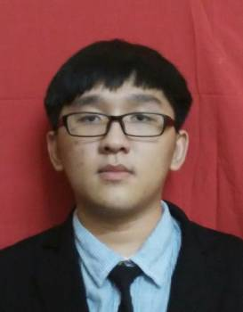

# ABOUT AI Tech 
This company is setup by a group of AI enthusiastic students in UTeM. They are passionate in AI software and products and hope to bring AI closer to everyone in the world.

Based in Malaysia, Malacca. 

## OUR MISSION
BRING CUTTING EDGE ARTIFICIAL INTELLIGENCE(AI) TECHNOLOGY TO THE COMMUNITY AND DAILY LIFE

## Innovation
We change the way of how people think about AI and change their life habit. 

## OUR TEAM
**CHIEF EXECUTIVE OFFICIAL (CEO)**

**LAW LIP YANG**

Resposiblity:
1. Manage the company staff and organization workflow
2. Making major corporate decisions 
3. Manage and allocate the resources of the company
4. Make sure project meet the dateline

 

**CHIEF OPERATING OFFICIAL (COO)**

**NABILAH BINTI MOHD NOOR**

Responsibility:
1. Report directly to CEO on any project progress and status
2. Identify risks and threat that might be happened in the company
3. Aids CEO in attending public events and meet more people on the community
4. Maintain public relations with other members of the company

 
